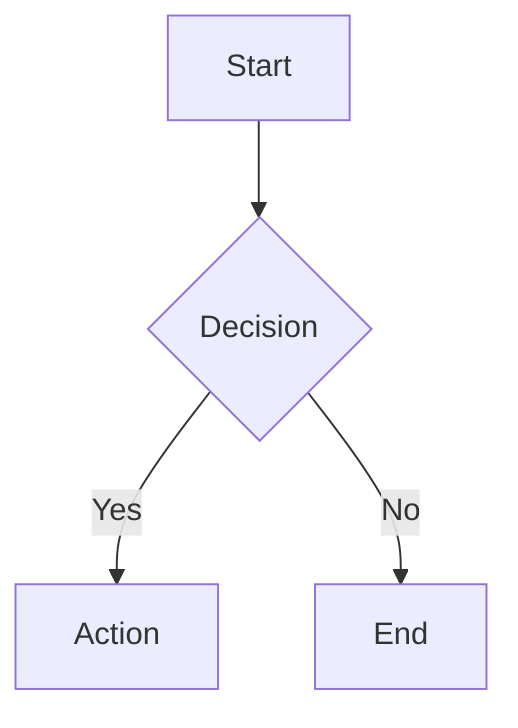
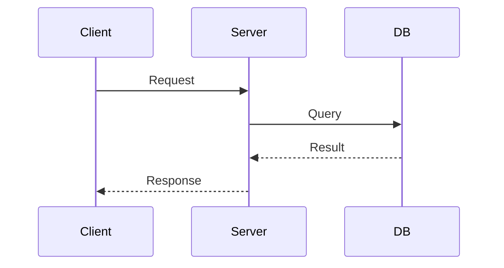

# Docs Writer

## Purpose

Keep documentation aligned with how the system actually works. Support both full document creation and targeted section editing.

## When To Use

Load this skill when writing or updating:

- README files
- onboarding docs
- runbooks
- API usage notes
- project operating instructions
- architecture diagrams
- any documentation that should stay in sync with code

## Workflow

1. Confirm the target audience and document purpose.
2. Verify current behavior from source, commands, or config before writing.
3. Determine scope: full document or section edit.
4. For section edits, update only the sections that need to change — do not rewrite the entire document.
5. Prefer concise instructions, examples, and commands over long prose.
6. Use diagrams (mermaid) for complex flows or architecture.
7. Call out assumptions or areas that still need verification.

## Section Editing

For targeted updates, prefer editing specific sections rather than rewriting the full document:

1. Identify which section(s) need updating.
2. Read the current section content.
3. Update only the affected section while preserving surrounding structure.
4. Verify the update does not break references or flow.

This is more efficient and less error-prone than full document rewrites.

## Mermaid Diagrams

Use mermaid diagrams for:
- Architecture diagrams
- Flowcharts
- Sequence diagrams
- Entity relationships
- Decision trees

````markdown

````

````markdown

````

Diagrams render in GitHub, most doc platforms, and many editor previews. Use them when a text description would be confusing.

## Output Format

Present results using the Shared Output Contract:

1. **Goal/Result** — what document was created, updated, or inspected
2. **Key Details:**
   - target document and audience
   - what changed (or what was created)
   - source of truth used for verification
   - whether section edit or full rewrite
   - assumptions or follow-ups
3. **Next Action** — only when a natural follow-up exists:
   - if doc reveals code issues → `debug`
   - if doc is part of feature work → `verification-before-completion`

## Documentation Rules

- Verify against actual source before writing.
- Prefer section edits over full rewrites.
- Use mermaid for complex flows.
- Keep instructions concise with examples and commands.
- Remove stale commands, paths, and references.
- Do not mix user instructions with internal implementation details unnecessarily.

## Red Flags

- copying old docs forward without checking the current code
- writing broad architecture claims without source verification
- mixing user instructions with internal implementation details unnecessarily
- leaving stale commands or paths in place
- rewriting an entire document when only one section needed updating
- creating near-duplicate docs instead of updating existing ones
- leaving broken cross-references after an edit

## Checklist

- [ ] Target audience confirmed
- [ ] Current behavior verified from source
- [ ] Scope determined (section edit vs full document)
- [ ] Content written with concise examples
- [ ] Mermaid diagrams used where helpful
- [ ] Stale content removed or corrected
- [ ] Cross-references checked
- [ ] Source of truth documented

## Done Criteria

This skill is complete when the updated document has been verified against the actual source, all stale commands or paths have been corrected or removed, and the output names the specific files or commands that were checked.
