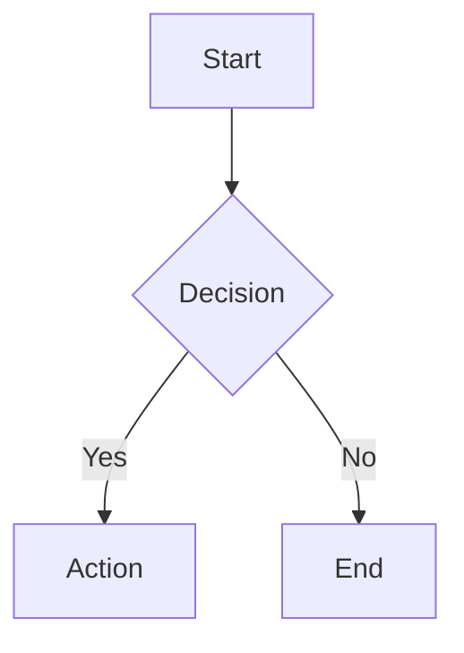
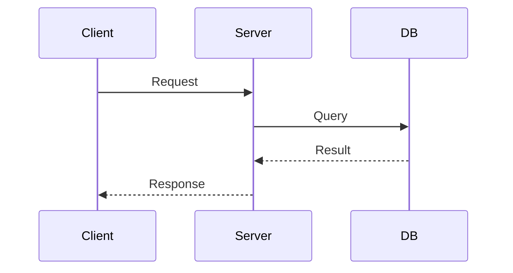

# Docs Writer

## Purpose

Keep documentation aligned with how the system actually works. Support both full document creation and targeted section editing.

Load [references/prompt-template.md](references/prompt-template.md) when the user wants a polished reusable prompt or when you need a starting template before editing docs directly.

## When To Use

Load this skill when writing or updating:

- README files
- onboarding docs
- runbooks
- API usage notes
- project operating instructions
- architecture diagrams
- any documentation that should stay in sync with code

## Modes

Choose the lightest mode that fits the request.

- `Prompt-only`: refine the user's raw docs-refresh prompt and return the upgraded prompt.
- `Docs execution`: inspect the repo and update the relevant docs directly.
- `Prompt + execution`: return the upgraded prompt and use the same standards while editing docs.

## Workflow

### 1. Inventory the documentation surface

Find the docs that may need to move together:

- `README.md`
- contributor or setup docs
- `docs/` pages
- examples, templates, or onboarding guides
- CLI or API docs generated from source-adjacent files

Do not assume the README is the only source that matters.

### 2. Rebuild the current product and workflow state

Treat the repository as the source of truth.

Check the most authoritative artifacts available, such as:

- command help text, scripts, task runners, and package manifests
- config files, environment examples, and migration files
- implementation code for user-facing features
- tests that document supported behavior
- existing docs only after comparing them to the code

When commands, flags, options, or workflows can be verified from source, verify them instead of inferring.

### 3. Identify documentation deltas

Capture what the docs need to describe in their current form:

- current commands, subcommands, flags, and options
- current setup, install, deploy, and development flows
- current features, integrations, and limitations
- renamed, removed, or superseded behavior that should disappear from the docs
- duplicated guidance that now needs to be synchronized across files

### 4. Rewrite in evergreen current-state language

Write as if the documented behavior has always been part of the project.

Use these rules without exception:

- describe the present state, not the history of how it changed
- remove stale wording instead of narrating the transition
- preserve the project's voice and structure unless a clearer structure is needed
- update every relevant doc file that carries the affected information

Avoid release-note phrasing such as:

- `we added`
- `now supports`
- `recently`
- `has been updated`
- `X is now Y`

### 5. Section Editing

For targeted updates, prefer editing specific sections rather than rewriting the full document:

1. Identify which section(s) need updating.
2. Read the current section content.
3. Update only the affected section while preserving surrounding structure.
4. Verify the update does not break references or flow.

This is more efficient and less error-prone than full document rewrites.

### 6. Verify before finishing

Check that:

- commands and examples match the real interface
- options and configuration names match the current code
- duplicated docs agree with each other
- stale statements, placeholders, and contradictions are removed
- links still resolve if you touched public docs

## Mermaid Diagrams

Use mermaid diagrams for:
- Architecture diagrams
- Flowcharts
- Sequence diagrams
- Entity relationships
- Decision trees

````markdown

````

````markdown

````

Diagrams render in GitHub, most doc platforms, and many editor previews. Use them when a text description would be confusing.

## Output Format

Present results using the Shared Output Contract:

1. **Goal/Result** — what document was created, updated, or inspected
2. **Key Details:**
   - target document and audience
   - what changed (or what was created)
   - source of truth used for verification
   - whether section edit or full rewrite
   - assumptions or follow-ups
3. **Next Action** — only when a natural follow-up exists:
   - if doc reveals code issues → `debug`
   - if doc is part of feature work → `verification-before-completion`

## Documentation Rules

- Verify against actual source before writing.
- Prefer section edits over full rewrites.
- Use mermaid for complex flows.
- Keep instructions concise with examples and commands.
- Remove stale commands, paths, and references.
- Do not mix user instructions with internal implementation details unnecessarily.

## Prompt Upgrade Rules

When the user gives a rough prompt, keep the intent but add the missing execution structure:

- tell the agent to inspect the repo before editing docs
- tell the agent to treat code and config as canonical over stale docs
- require updating all relevant documentation, not only the README
- require evergreen phrasing with no change-log language
- require explicit coverage of commands, options, features, and workflows
- require a verification pass for consistency and outdated content

Prefer the template in [references/prompt-template.md](references/prompt-template.md) over improvising from scratch.

## Red Flags

- copying old docs forward without checking the current code
- writing broad architecture claims without source verification
- mixing user instructions with internal implementation details unnecessarily
- leaving stale commands or paths in place
- rewriting an entire document when only one section needed updating
- creating near-duplicate docs instead of updating existing ones
- leaving broken cross-references after an edit
- trusting existing docs without checking source
- updating only `README.md` when the same information lives elsewhere
- documenting commands or flags that were not verified
- keeping historical phrasing like a mini changelog
- leaving contradictory old guidance in secondary docs

## Checklist

- [ ] Target audience confirmed
- [ ] Current behavior verified from source
- [ ] Scope determined (section edit vs full document)
- [ ] Content written with concise examples
- [ ] Mermaid diagrams used where helpful
- [ ] Stale content removed or corrected
- [ ] Cross-references checked
- [ ] Source of truth documented

## Done Criteria

This skill is complete when:

- The updated document or refined prompt has been verified against the actual source.
- All stale commands or paths have been corrected or removed.
- The output names the specific files or commands that were checked.
- Documentation describes only the current state of the project.
- Relevant commands, options, features, and workflows are included.
- Stale or transitional wording has been removed.
- Documentation is internally consistent across the touched documentation set.
